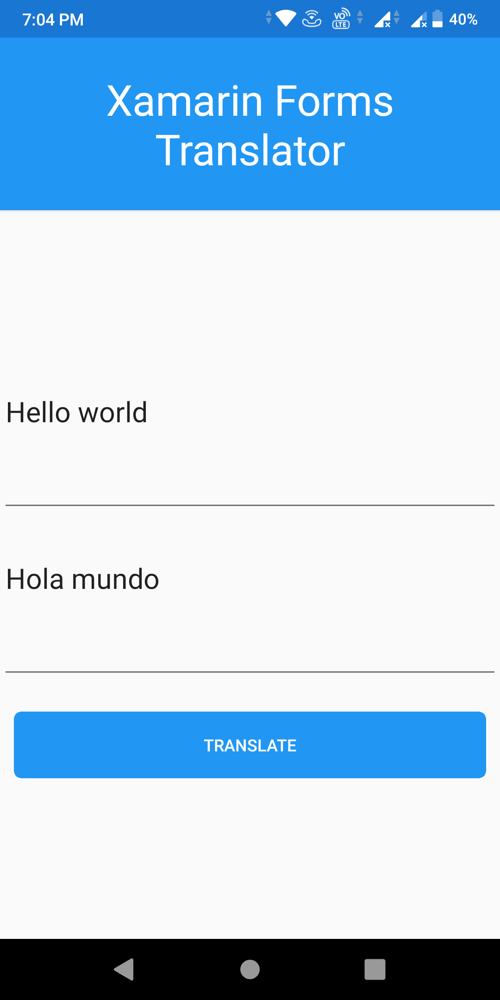

# TranslatorXamarinForms
Language Translation in Xamarin Forms using Azure Cognitive Services
Prerequisites 
1. Azure subscription [Azure Service Account](https://azure.microsoft.com/en-us/free/cognitive-services/)
2. Once you have an Azure subscription, [create a Translator resource](https://ms.portal.azure.com/#create/Microsoft.CognitiveServicesTextTranslation) in the Azure portal to get your key and endpoint. After it deploys, select Go to resource.
You'll need the key and endpoint from the resource to connect your application to the Translator service. You'll paste your key and endpoint into the code below later in the quickstart.
3. You can use the free pricing tier (F0) to try the service, and upgrade later to a paid tier for production.

Once your Azure Service is created you need to copy -
1. Key
2. Endpoint
3. location
And replace it in the MainPage.cs file, and you are good to go.

